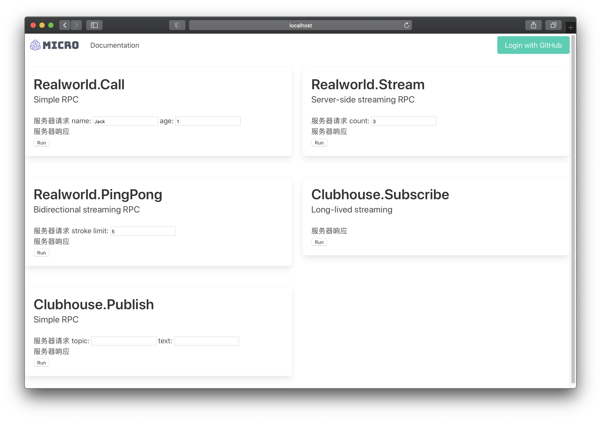

验证和调试具有认证机制的服务 API
===

Setup 启动服务
---

在[快速开始](getting-started.md)教程里，我们启动的是一套没有认证鉴权机制的服务体系，它的组成有

* 客户端 curl
* 服务网关 go.micro.api
* 业务服务 com.example.service.realworld

这个教程，将启动一套具备认证鉴权机制的服务体系，它的组成有

* 认证服务 go.micro.auth
* 门户服务 com.example.portal
* 客户端 Chrome/Firefox/Safari
* 服务网关 go.micro.api
* 业务服务 com.example.service.realworld

相比较而言，多出的组件有，认证服务和门户服务。另外，客户端换成了浏览器，以更好的演示实战场景。

认证服务，管理用户数据库和权限规则库。门户服务，提供浏览器要加载的网页资源，以及用于认证的服务端点。

### 启动认证服务

```
$ micro --store sqlite --auth jwt auth
```

### 启动门户服务

在 nano-kit/realworld-example-app/cmd/portal 目录下

```
$ go run main.go
```

### 启动服务网关

先要创建服务网关的 Service Account

```
$ micro login --namespace go.micro default password
$ micro auth create account --secret 123456 --scopes service api-gate
$ micro login --namespace com.example default password
```

```
$ MICRO_LOG_LEVEL=debug micro --auth service --auth_id api-gate --auth_secret 123456 api --namespace com.example --type service
```

Caution: 此处的服务网关账号密码仅仅作为 localhost 演示用，上线部署时一定要妥善保管好服务网关账号密码。

查看权限规则，确保一下权限已经设定到规则库里

```
$ micro auth list rules
ID				Scope			Access		Resource								Priority
realworld-stream		<public>		GRANTED		service:com.example.service.realworld:Realworld.Stream			100
realworld-pingpong		<public>		GRANTED		service:com.example.service.realworld:Realworld.PingPong		100
clubhouse-subscribe		<public>		GRANTED		service:com.example.service.realworld:Clubhouse.Subscribe		100
any-account			*			GRANTED		*:*:*									2
deny-public			<public>		DENIED		*:*:*									1
```

### 启动业务服务

在 nano-kit/realworld-example-app 目录下

```
$ go run main.go
```

### 启动浏览器

连接 http://localhost:9100


