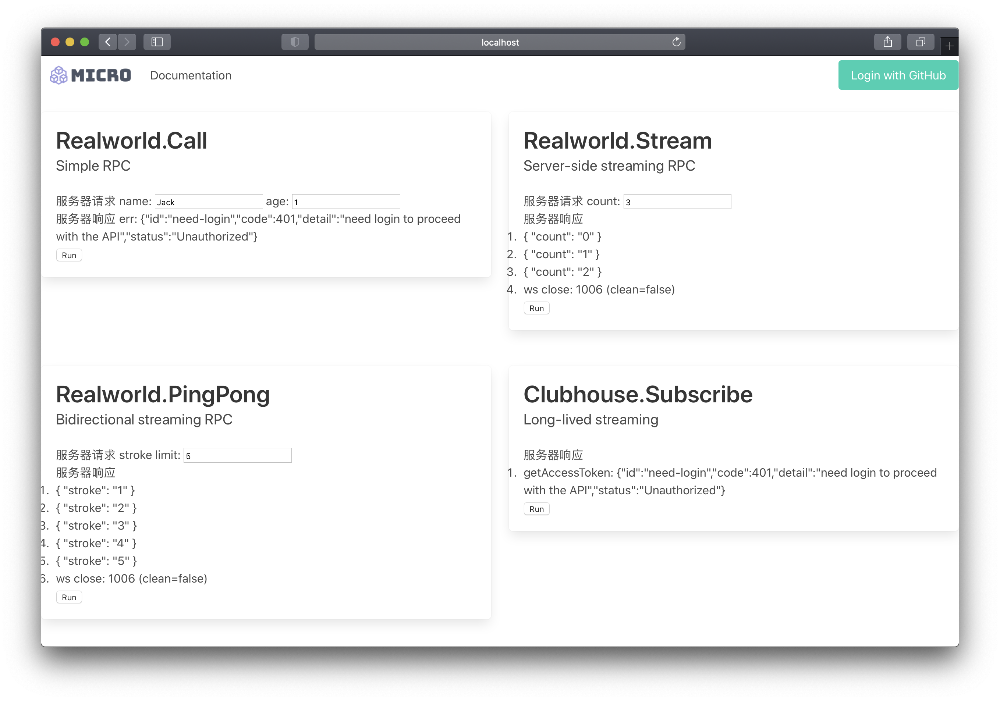
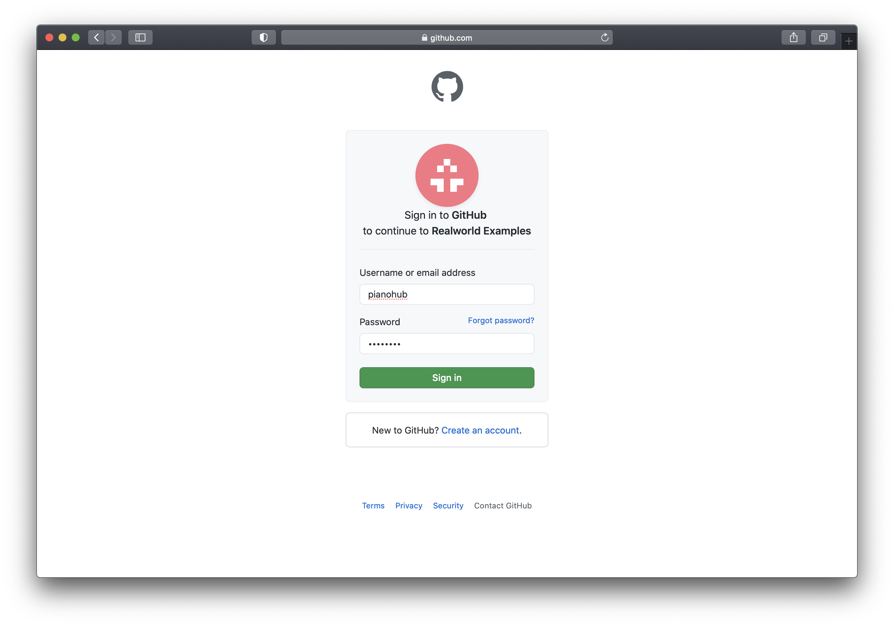
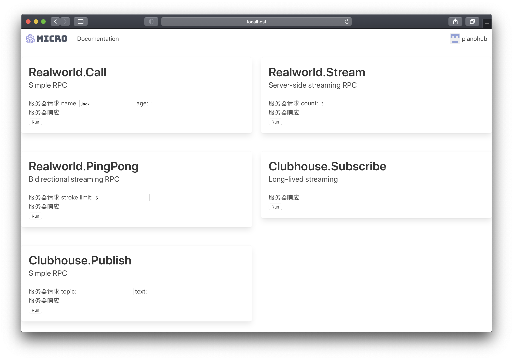
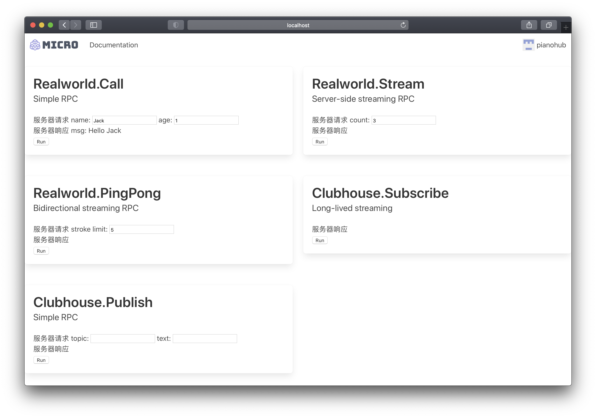

验证和调试具有认证机制的服务 API
===

Setup 启动服务
---

在[快速开始](getting-started.md)教程里，我们启动的是一套没有认证鉴权机制的服务体系，它的组成有

* 客户端 curl
* 服务网关 go.micro.api
* 业务服务 com.example.service.realworld

这个教程，将启动一套具备认证鉴权机制的服务体系，它的组成有

* 认证服务 go.micro.auth
* 门户服务 com.example.portal
* 客户端 Chrome/Firefox/Safari
* 服务网关 go.micro.api
* 业务服务 com.example.service.realworld

相比较而言，多出的组件有，认证服务和门户服务。另外，客户端换成了浏览器，以更好的演示实战场景。

认证服务，管理用户数据库和权限规则库。门户服务，提供浏览器要加载的网页资源，以及用于认证的服务端点。

### 启动认证服务

```
$ micro --store sqlite --auth jwt auth
```

### 启动门户服务

在 nano-kit/realworld-example-app/cmd/portal 目录下

```
$ go run main.go
```

### 启动服务网关

先要创建服务网关的 Service Account

```
$ micro login --namespace go.micro default password
$ micro auth create account --secret 123456 --scopes service api-gate
$ micro login --namespace com.example default password
```

```
$ MICRO_LOG_LEVEL=debug micro --auth service --auth_id api-gate --auth_secret 123456 api --namespace com.example --type service
```

**Caution:** 此处的服务网关账号密码仅仅作为 localhost 演示用，上线部署时一定要妥善保管好服务网关账号密码。

查看权限规则，确保以下权限已经设定到规则库里

```
$ micro auth list rules
ID				Scope			Access		Resource								Priority
realworld-stream		<public>		GRANTED		service:com.example.service.realworld:Realworld.Stream			100
realworld-pingpong		<public>		GRANTED		service:com.example.service.realworld:Realworld.PingPong		100
clubhouse-subscribe		<public>		GRANTED		service:com.example.service.realworld:Clubhouse.Subscribe		100
any-account			*			GRANTED		*:*:*									2
deny-public			<public>		DENIED		*:*:*									1
```

### 启动业务服务

在 nano-kit/realworld-example-app 目录下

```
$ go run main.go
```

### 启动浏览器

连接 http://localhost:9100


在这个演示里，我们将用 JavaScript 调用业务服务的 5 个端点。协议定义在 [Protobuf 文件](https://github.com/nano-kit/realworld-example-app/blob/c8056dd1327756752f8208513816af676d82372d/proto/realworld/realworld.proto)里，包括了普通 RPC 和流式 RPC 等等各种示例。


Demo 开始演示
---

在没有登录时，点击 Run 调用这些 RPC ，会收到 401 Unauthorized 响应。



注意，流式 RPC 基于 WebSocket 接入，无法识别 Authorization Header，因此，认证鉴权只能由业务协议实现。未实现的接口，比如 Stream/PingPong 是可以在未登录时正常调用的。

现在点击右上角的 Login with GitHub，进入登录页。



填入用户名、密码，登录成功之后，会回到主页面。



此时页面的右上角有账号的头像和名称。再一次点击 Run 调用这些 RPC，



服务器有正常的响应了。同时，业务服务会在日志里输出

```
level=info Received Realworld.Call request {"name":"Jack","age":1} from account &{ID:pianohub Type:user Issuer:com.example Metadata:map[AvatarUrl:https://avatars.githubusercontent.com/u/10321198?v=4 Company: Email: Location: Name:] Scopes:[basic] Secret:}
```

说明服务请求方的身份也能鉴别出来。

Push 订阅和服务端推送
---

点击 Clubhouse.Subscribe 下的 Run，会显示 Connected，表示从浏览器建立了一条长连接流式 RPC 到业务服务，订阅的 topic 是自己的 ID pianohub。一旦有消息送达这个 topic，浏览器就能收到业务服务主动推送的通知。


填好 topic 和 text，点击 Clubhouse.Publish 下的 Run，用这种方式来模拟向这个 topic 发送一条消息。


可以看到一条推送消息出现在 Clubhouse.Subscribe 的服务器响应里。

注意，长连接流式 RPC 要求客户端在收到服务端推送的 HEARTBEAT 时，立刻发送 HEARTBEAT 宣告自己存活。未及时发送 HEARTBEAT 的客户端，会被服务端断开。这是因为，未结束的长连接流式 RPC 持久占用服务端资源。实践中，业务服务还需要实现多端管理机制，保证每一个客户端设备，只与服务器建立一条长连接，拒绝多余的长连接。

接下来，我们可以参考业务服务的[代码](https://github.com/nano-kit/realworld-example-app)和日志输出，来理解、验证和调试具有认证机制的服务 API，本教程结束。
